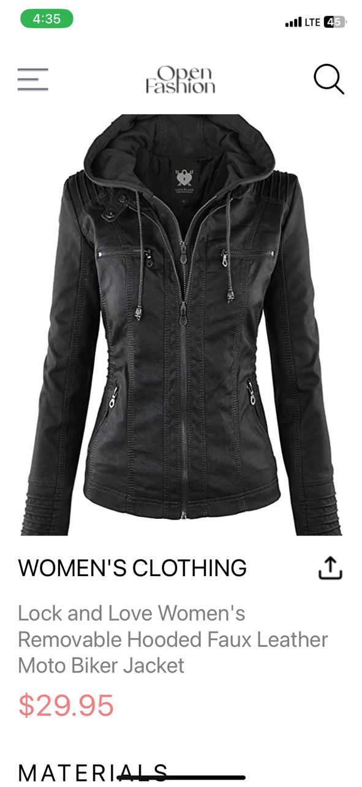
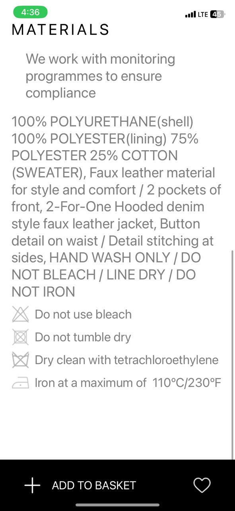

# React Native Shopping App

## Overview

This document provides an overview of the design choices and implementation details for the `DetailsScreen` component in a React Native shopping application. The screen displays detailed information about a selected product, including its image, name, price, description, category, and related precautions.

## Design Choices

### Component Structure

The application follows a component-based structure, which enhances code reusability and maintainability. The main components involved in the `DetailsScreen` are:

- **CustomDrawerButton**: A custom button to open the navigation drawer.
- **Image**: Displays images from the given URI.
- **ScrollView**: Allows vertical scrolling of content.
- **SafeAreaView**: Ensures that content is displayed within the safe area boundaries of a device.
- **Pressable**: A wrapper for making elements pressable.

### Styling

The styling is handled using the `StyleSheet` from React Native, ensuring a consistent design across the application. Key styles include:

- `container`: Defines the main layout of the screen.
- `homeHeader`: Styles for the header section.
- `headerIcon`: Styles for icons in the header.
- `imageContainer`: Container for the product image.
- `image`: Styles for the product image to ensure it covers the container.
- `detailsContainer`: Container for the product details.
- `detailsHeader`: Styles for the header of the details section.
- `descriptionText`: Styles for descriptive text.

### Layout

The layout is designed to ensure a seamless user experience with vertical scrolling enabled via `ScrollView`. The `View` components are used to structure the content logically, and the `Image` component is used to display the product image fetched from a URI.

### Data Handling

Data passed to the `DetailsScreen` component via `route.params` includes:
- `image`: URI of the product image.
- `description`: Description of the product.
- `name`: Name of the product.
- `price`: Price of the product.
- `category`: Category of the product.

## Screenshots of the pages

